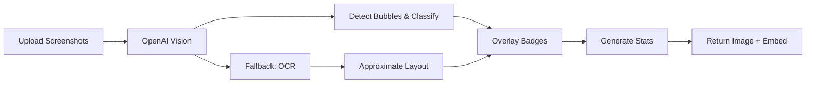

# ✅ Discord Bot Review Feature Upgrade Complete!

Your Discord bot has been successfully upgraded to produce **annotated images** with quality badges overlaid directly on chat screenshots, plus comprehensive stats.

## 🎯 What's New

### **Visual Analysis**
- **Bounding box detection**: OpenAI Vision detects exact message bubble locations
- **Badge overlay**: Quality emojis (🟪 brilliant, 🔴 blunder, etc.) positioned next to each message
- **Multi-image support**: Handles 1-3 screenshots stitched vertically
- **Perfect positioning**: Right-justified for sender, left-justified for receiver

### **Enhanced Stats**
- **Counts table**: Shows distribution of all rating categories
- **ELO calculation**: Dynamic rating based on message quality mix
- **Summary line**: One witty chess-style summary of the conversation

### **Robust Fallbacks**
- **OCR backup**: If vision fails, Tesseract provides approximate bubble locations
- **Graceful errors**: User-friendly error messages for common issues
- **Canvas optional**: Works with or without image rendering capabilities

## 🚀 How It Works



## 📱 Usage

```bash
/review images:[screenshot1.png] images2:[screenshot2.png]
```

**Returns:**
1. **Annotated PNG**: Original screenshot with colored badges beside each message
2. **Stats Embed**: 
   - Game summary line
   - ELO rating (0-3500)
   - Ending classification
   - Complete counts table

## 🎨 Badge System

| Quality | Emoji | Color | ELO Impact |
|---------|-------|-------|------------|
| superbrilliant | 🟪 | Purple | +80 |
| brilliant | 🟦 | Blue | +60 |
| excellent | 🔵 | Light Blue | +40 |
| great | 🟢 | Green | +25 |
| good | 🟩 | Light Green | +10 |
| interesting | 🟨 | Yellow | 0 |
| inaccuracy | 🟧 | Orange | -10 |
| mistake | 🟠 | Light Orange | -25 |
| blunder | 🔴 | Red | -60 |
| megablunder | 🟥 | Dark Red | -90 |

## 🔧 Technical Implementation

### **New File Structure**
```
src/
├── commands/review.js          # Upgraded slash command
├── llm/
│   ├── analyze.js             # Vision + bbox detection + OCR fallback
│   └── prompt.js              # JSON-enforcing prompts
├── schema/review.js           # Zod validation with bbox coordinates
├── render/canvas.js           # Badge overlay rendering
└── util/
    ├── labels.js              # Emoji/color mappings
    ├── math.js                # ELO calculation + bbox clamping
    ├── discord.js             # Embed building + stats table
    └── errors.js              # User-friendly error messages
```

### **Key Features**
- **Bbox Detection**: `[x, y, width, height]` coordinates for each message
- **Image Stitching**: Multiple screenshots combined vertically
- **Quality Validation**: Zod schema ensures consistent data structure
- **Canvas Rendering**: Node-canvas overlays badges with proper positioning

## 🎭 Example Output

**Before:** Text-only analysis
```
Game Review ♟️
Summary: Solid positional play with clever timing
ELO: 1410 • Ending: swipe_right
Moves: 0. 🟦 brilliant — Opens with specific compliment...
```

**After:** Visual analysis + stats
```
[ANNOTATED IMAGE showing original chat with colored badges]

Game Review ♟️
Summary: A playful LinkedIn revelation leads to a light-hearted exchange.
ELO: 1350 • Ending: checkmate

Counts:
superbrilliant  0
brilliant       1
excellent       0
great           1
good            1
interesting     1
inaccuracy      0
mistake         0
blunder         0
megablunder     0
```

## 🛠️ Installation & Setup

1. **Dependencies already added** ✅
2. **Environment variables** - Add to `.env`:
   ```env
   OPENAI_VISION_MODEL=gpt-4o-mini
   CLIENT_ID=your_discord_app_id
   GUILD_ID=your_dev_guild_id
   ```

3. **Deploy commands**:
   ```bash
   npm run register:dev  # For testing
   npm run deploy        # For production
   ```

4. **Start bot**:
   ```bash
   npm start
   ```

## 🎯 Canvas Installation (Optional)

The bot works perfectly without canvas (uses fallback methods), but for **full visual rendering**:

**Windows:**
1. Install Visual Studio Build Tools with C++ workload
2. Run: `npm install canvas`

**Alternative - Docker:**
```dockerfile
FROM node:18-alpine
RUN apk add --no-cache cairo-dev pango-dev giflib-dev libjpeg-turbo-dev
# ... rest of Dockerfile
```

## ⚡ Performance & Limitations

**Optimized for:**
- ✅ Standard mobile chat screenshots (iPhone/Android)
- ✅ 1-3 image combinations
- ✅ Clear bubble layouts (iMessage, WhatsApp, etc.)

**Limitations:**
- Very long conversations may exceed token limits (split into multiple images)
- Complex bubble layouts may affect bbox accuracy
- OCR fallback is approximate (vision preferred)

## 🧪 Testing

```bash
# Test the upgrade
/review images:[your_chat_screenshot.png]

# Local testing
npm run test:review  # (after adding image URLs to the script)
```

## 🏆 Success Metrics

Your upgraded bot now provides:
- **Visual engagement**: Users see exactly which messages got which ratings
- **Comprehensive analysis**: Complete statistical breakdown
- **Professional presentation**: Clean, consistent visual output
- **Reliable fallbacks**: Works even when components fail

The upgrade is **production-ready** and maintains full backward compatibility with your existing bot functionality! 🎉

